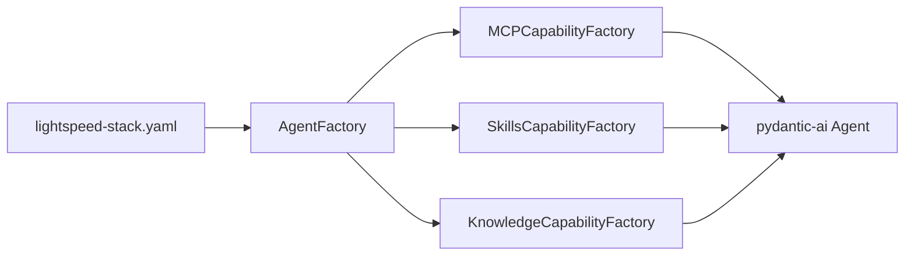
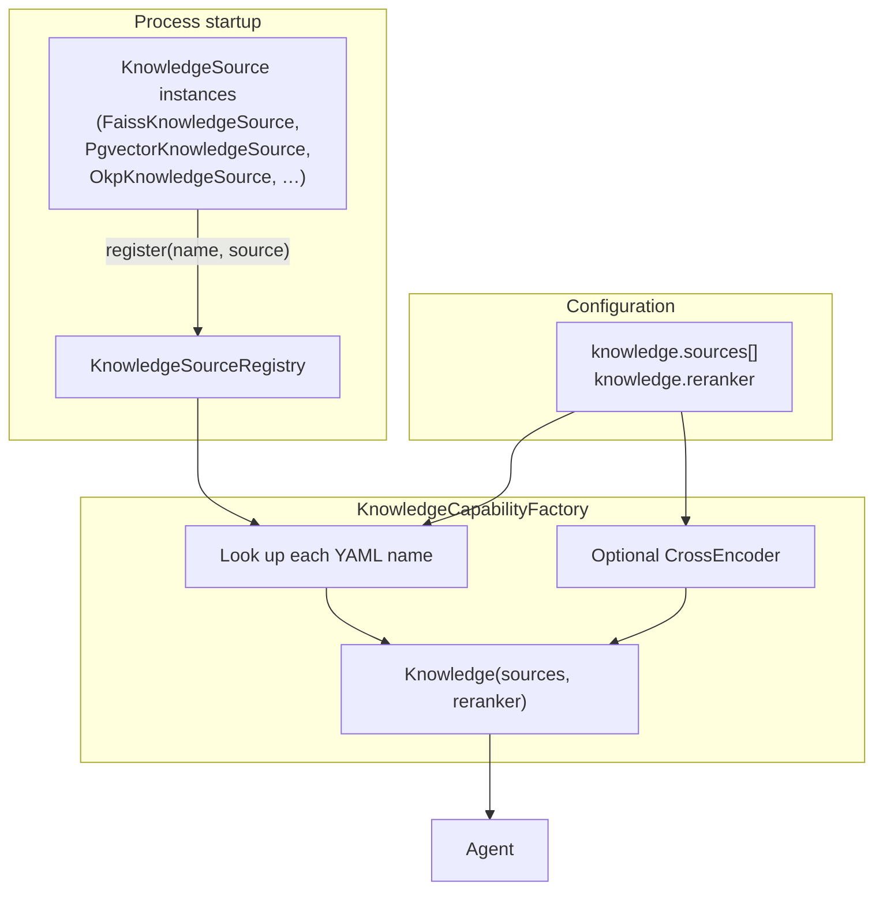
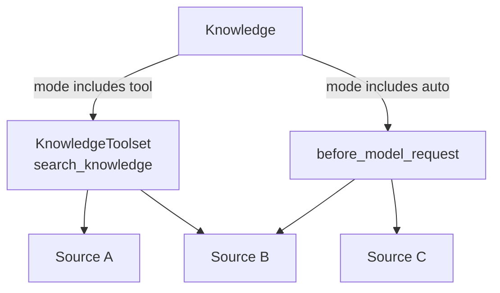
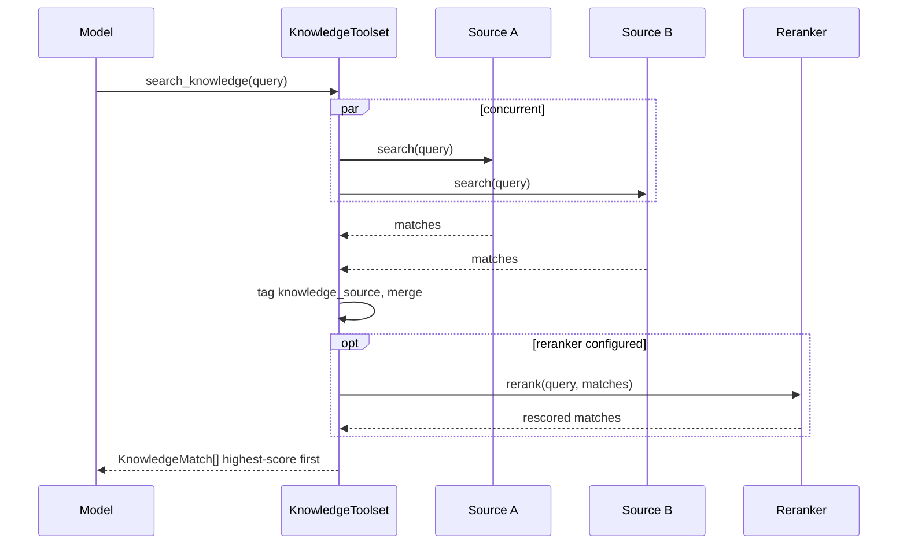
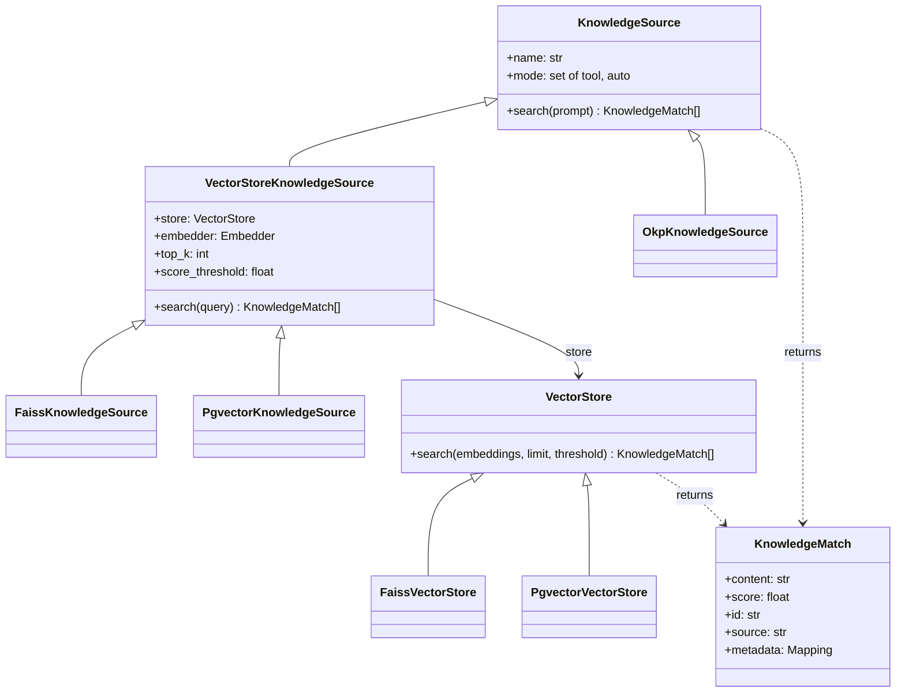
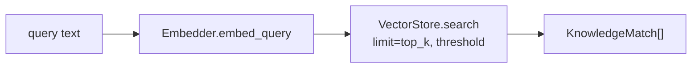
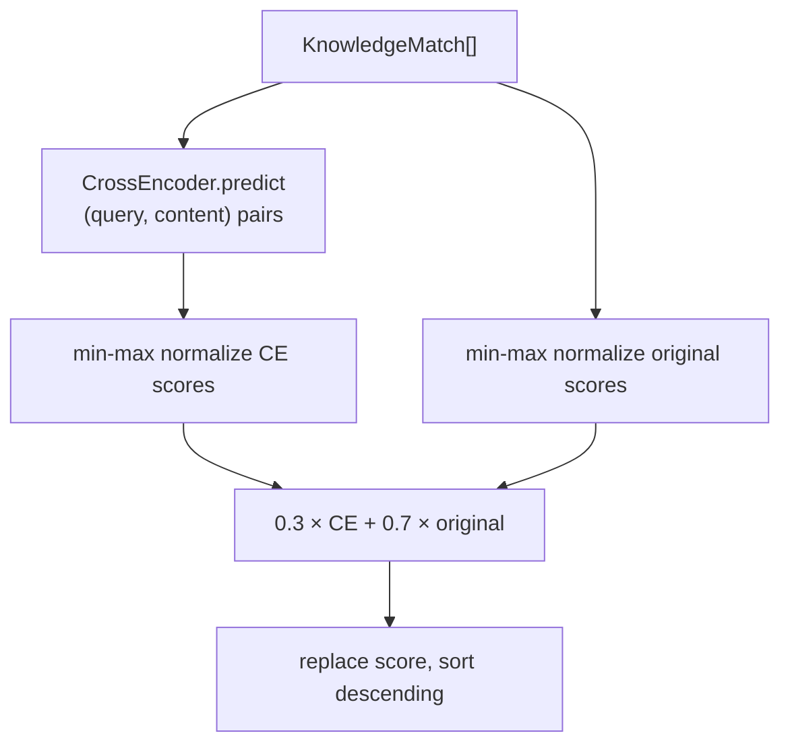

# Knowledge

Vector-similarity search (RAG) for Lightspeed agents.

Knowledge is a pydantic-ai **capability**, the same attachment point used for MCP servers and skills. One `Knowledge` instance wraps every configured source. Each source decides how *it* is exposed — as a model-callable tool, as automatic context injection, or both — so a single agent can mix backends and exposure modes without a second capability.

## How it fits on the agent

`AgentFactory` builds three capability families from `lightspeed-stack.yaml` and passes them into `Agent(capabilities=...)`:



MCP produces one capability per server. Skills and Knowledge each produce **one** capability that covers the whole configured set. Knowledge then splits internally by source `mode` (`tool`, `auto`, or both).

## Assembly

YAML names the sources the agent should use. Live backends are **hand-registered** in a process-wide `KnowledgeSourceRegistry` (by the same `name`) before any agent is built. The factory does not yet construct a Faiss / pgvector / OKP store from `type` / `config` / `embedding_model`; those fields describe the backend a future builder would connect to.



Duplicate YAML names raise `ValueError`. A name with no registered source raises `KeyError`.

## Runtime shape

`Knowledge` is an `AbstractCapability`. It contributes at most two things to a run:

| Hook | When | What |
| --- | --- | --- |
| `get_toolset()` | Agent construction | A `KnowledgeToolset` exposing one `search_knowledge` tool over every source whose `mode` includes `'tool'`. `None` if no tool-mode sources exist. |
| `before_model_request()` | Every model call | Search every auto-mode source against the latest user prompt, merge and rank the matches, and append them as delimited context. |



`mode` lives on the source, not on the capability, so one `Knowledge` can combine:

- a docs index the model searches on demand (`{'tool'}`)
- a policy store injected on every turn (`{'auto'}`)
- a wiki that does both (`{'tool', 'auto'}`)

## Request flows

### Auto: inline retrieval

Auto sources search **the latest user prompt**, not a model-written query. All auto-mode sources are searched concurrently, then matches are merged, tagged with `knowledge_source`, and ranked once — the same pipeline as `search_knowledge`. The ranked list is appended as a single `TextContent` block so the model sees them before it answers.

```mermaid
sequenceDiagram
  participant User
  participant Agent
  participant Knowledge
  participant A as Source A
  participant B as Source B
  participant Reranker
  participant Model

  User->>Agent: prompt
  Agent->>Knowledge: before_model_request
  par concurrent
    Knowledge->>A: search(prompt)
    Knowledge->>B: search(prompt)
  end
  A-->>Knowledge: matches
  B-->>Knowledge: matches
  Knowledge->>Knowledge: tag knowledge_source, merge
  opt reranker configured
    Knowledge->>Reranker: rerank(prompt, matches)
    Reranker-->>Knowledge: rescored matches
  end
  Knowledge->>Agent: append one &lt;knowledge&gt; block
  Agent->>Model: request with injected context
```

Injected text is bounded XML, not free-form prose. Matches appear highest-score-first; `knowledge_source` on each match names the originating source:

```xml
<knowledge>
<match id="…" source="doc://page" knowledge_source="product-docs">
chunk text
</match>
</knowledge>
```

Scores and per-match metadata ride on `TextContent.metadata` (`kind=knowledge`) so downstream tracing can attribute chunks without stuffing that into the prompt.

### Tool: model-initiated search

Tool-mode sources share a **single** `search_knowledge` tool (not one `search_<name>` per source). One call fans out concurrently, tags every hit with `metadata['knowledge_source']`, then ranks.



If there is no reranker, merged matches are sorted by each source's own similarity score. Tool results are untrusted reference data — the tool docstring tells the model to verify anything safety- or decision-critical.

## Source model

Everything searchable implements `KnowledgeSource.search(prompt) -> list[KnowledgeMatch]`. Vector indexes go through a second split: an `Embedder` turns the query into vectors, a `VectorStore` retrieves by those vectors.



`VectorStoreKnowledgeSource.search` is the shared vector RAG loop:



`FaissKnowledgeSource` and `PgvectorKnowledgeSource` are embedding indexes: each wraps a `VectorStore` (`FaissVectorStore`, `PgvectorVectorStore`) and reuses `VectorStoreKnowledgeSource.search`. A backend that is not an embedding index subclasses `KnowledgeSource` directly and implements `search` itself — `OkpKnowledgeSource` is that path.

### Matches

`KnowledgeMatch` is the unit both paths return:

| Field | Role |
| --- | --- |
| `content` | Chunk text shown to the model |
| `score` | Higher is more relevant |
| `id` | Stable id for this hit (generated if the backend does not supply one) |
| `source` | Citation identifier (document URI, chunk id, …) |
| `metadata` | Backend-specific extras; tool-mode adds `knowledge_source` |

## Reranking

Optional, capability-wide, applied **after** source search in both auto and tool paths. Configured as a `sentence-transformers` cross-encoder model id (for example `cross-encoder/ms-marco-MiniLM-L-6-v2`).



Original similarity (including any per-source weighting) keeps 70% of the combined score so a cross-encoder cannot fully wash out the index ranking. If scoring fails, matches are returned unchanged and a warning is logged.

## Configuration

```yaml
knowledge:
  reranker:
    model: cross-encoder/ms-marco-MiniLM-L-6-v2
  sources:
    - name: product-docs
      type: faiss          # faiss | pgvector | okp
      mode: [tool]         # tool, auto, or both
      config:
        db_path: /var/lib/rag/vector.db
        vector_store_id: product-docs
      embedding_model: openai:text-embedding-3-small
      top_k: 5
```

Until a backend builder exists, register a matching `KnowledgeSource` under the same name at startup:

```python
from lightspeed.core.agent.knowledge.registry import KnowledgeSourceRegistry
from lightspeed.core.agent.knowledge.sources.faiss import FaissKnowledgeSource

KnowledgeSourceRegistry().register(
    "product-docs",
    FaissKnowledgeSource(
        name="product-docs",
        db_path="/var/lib/rag/vector.db",
        vector_store_id="product-docs",
        embedder=embedder,
        mode={"tool"},
    ),
)
```

`Knowledge` can also be constructed directly for programmatic use, the same way harness `Memory` is used standalone.

## Package map

| Module | Responsibility |
| --- | --- |
| `capability.py` | `Knowledge` capability: toolset + auto-injection hook |
| `factory.py` | YAML → one `Knowledge` capability via the registry |
| `registry.py` | Process-wide `KnowledgeSource` singleton |
| `toolset.py` | Concurrent `search_knowledge` over tool-mode sources |
| `reranker.py` | Cross-encoder rescoring |
| `types.py` | `KnowledgeMatch` |
| `sources/base.py` | `KnowledgeSource`, `VectorStore`, `VectorStoreKnowledgeSource` |
| `sources/faiss.py` | sqlite-faiss store + `FaissKnowledgeSource` |
| `sources/pgvector.py` | Planned `PgvectorVectorStore` + `PgvectorKnowledgeSource` |
| `sources/okp.py` | Planned `OkpKnowledgeSource` |

## Faiss backend

`FaissVectorStore` reads the sqlite-faiss kvstore layout that `rag-content` writes (`vector_io::faiss:faiss_index:v3::<vector_store_id>`). The index and chunk map are loaded once in the constructor; search is read-only.

- One SQLite file can hold several stores; `vector_store_id` selects which this instance serves.
- Faiss search is a blocking C++ call, so it runs in a worker thread.
- Multi-vector queries merge hits, keep the best score per row, then truncate to `top_k`.
- L2 distance is converted to a higher-is-better score with `1 / (1 + distance)`; rows below `score_threshold` are dropped.

`FaissKnowledgeSource` is a convenience wrapper that builds the `FaissVectorStore` from `db_path` + `vector_store_id` so callers do not construct the store separately.

## Adding a backend

1. Implement `KnowledgeSource` (or `VectorStore` + `VectorStoreKnowledgeSource` if the backend is an embedding index).
2. Honor `name` and `mode` on the instance.
3. Return `KnowledgeMatch` values with content, score, and a citation `source` when the backend has one.
4. `KnowledgeSourceRegistry().register(name, source)` before `AgentFactory` runs.
5. List that `name` under `knowledge.sources` in YAML.

`PgvectorKnowledgeSource` and `OkpKnowledgeSource` are reserved `KnowledgeSourceType` values (`pgvector`, `okp`) with empty modules; they plug in at this same boundary.
